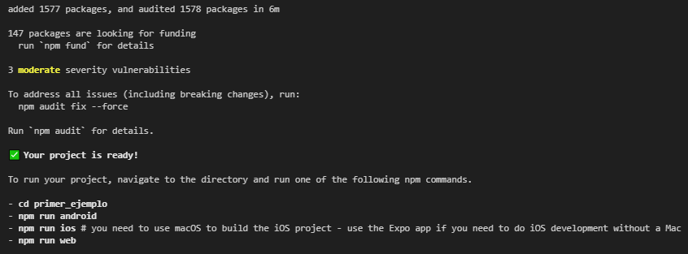
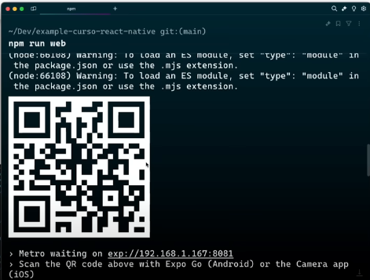
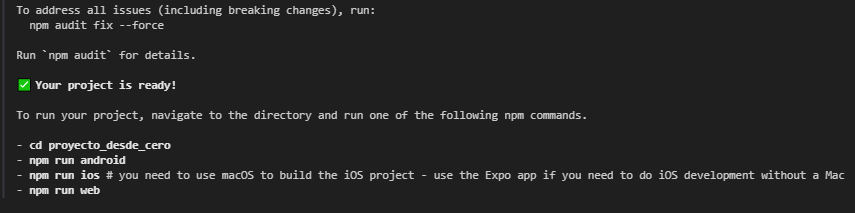

# Aprendiendo React Native
Para comenzar a trabajar con React native conviene emepzar a instalar un framework llamado "Expo". Es el equivalente en aplicaciones nativas a "Next.JS".  
`npx create-expo-app@latest`  
  
Luego, podemos empezar nuestra aplicacion con cualquiera de estos ejemplos:  
  
Lo mejor es empezar con la Web porque es más rápido, y el resto son emuladores un poco más lentos.  
Sin embargo, se puede utilizar un codigo QR.  
  
Este código QR, si lo escaneamos con nuestro dispositivo, se puede ver como se vería la aplicación en nuestro dispositivo.  
Para ello, se debe instalar una aplicacion llamada Go.  
  
El sistema de archivos generado es el siguiente:  
  
  
El proyecto asi creado tiene muchas dependencias y cosas que no necesitamos.  
Para crear un proyecto de React Native desde cero, se debe eejecutar el mismo comando anterior, pero dandole desde inicio un nombre a nuestro proyecto.  
`npx create-expo-app@latest proyecto_desde_cero --template blank`  
Lo de `--template blank` es para que no me instale ninguna plantilla por defecto.  
  
  
Allí se ve que la estructura de archivos creadas es mucho más simple que el caso anterior.  
